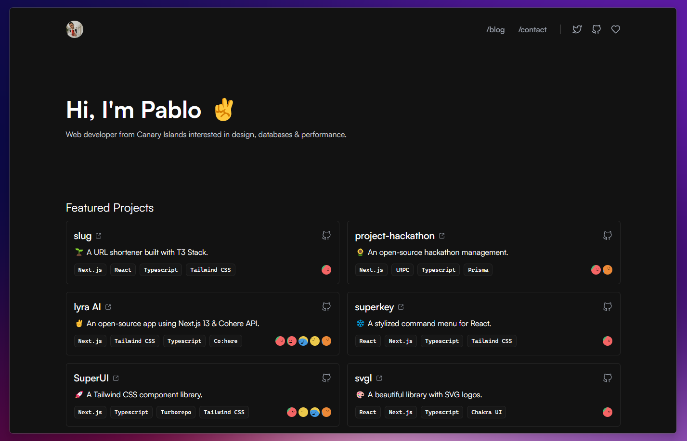

<div align="center">

<a href="https://www.pheralb.dev/" target="_blank">

</a>

</p>

<div align="center">
    <a href="https://pheralb.dev" target="_blank">
        Website
    </a>
    <span>&nbsp;⁘&nbsp;</span>
    <a href="#-getting-started">
        Getting Started
    </a>
    <span>&nbsp;⁘&nbsp;</span>
    <a href="#-stack">
        Stack
    </a>
    <span>&nbsp;⁘&nbsp;</span>
    <a href="#-license">
        License
    </a>
    <span>&nbsp;⁘&nbsp;</span>
    <a href="https://twitter.com/pheralb_" target="_blank">
        Twitter
    </a>
</div>

</p>


[](https://nodejs.org/about/releases)

</div>

## ⚙ Stack

- [**Astro** + Typescript](https://astro.build/) - Build the web
you want.
- [**React 18**](https://react.dev/) - The library for web and native user interfaces.
- [**Tailwind CSS**](https://tailwindcss.com/) - A utility-first CSS framework for rapidly building custom designs.
- [**Prettier** + prettier-plugin-tailwindcss](https://github.com/tailwindlabs/prettier-plugin-tailwindcss) - A Prettier plugin for Tailwind CSS that automatically sorts classes.
- [**Iconoir**](https://iconoir.com/) with [**React-Symbols**](https://react-symbols.vercel.app/) - Beautifully crafted SVG icons & logos.

## 🚀 Getting Started

We recommend using the following extensions for Visual Studio Code:

- [**Astro for VSCode**](https://marketplace.visualstudio.com/items?itemName=astro-build.astro-vscode).
- [**Tailwind CSS IntelliSense**](https://marketplace.visualstudio.com/items?itemName=bradlc.vscode-tailwindcss).
- [**PostCSS Language Support**](https://marketplace.visualstudio.com/items?itemName=csstools.postcss).
- [**Prettier - Code formatter**](https://marketplace.visualstudio.com/items?itemName=esbenp.prettier-vscode).

1. Clone the repository:

```bash
git@github.com:pheralb/website.git
```

2. Install dependencies:

```bash
npm install
# or
yarn install
# or
pnpm install
# or
ultra install
```

3. Run the development server:

```bash
npm run dev
# or
yarn dev
# or
pnpm dev
# or
ultra dev
```

📁 Folder structure:

```
[] .github - Funding file.
[] .vscode - Extensions, config & launch options for VSCode.
[] public - Static files.
[] src - Astro source code.
```

Open up [http://localhost:3000](http://localhost:3000) to view the website 🚀.

## 🌱 Shortcuts

- pheralb.dev[**/tw**](https://pheralb.dev/tw) - Twitter.
- pheralb.dev[**/tv**](https://pheralb.dev/tv) - Twitch.
- pheralb.dev[**/ln**](https://pheralb.dev/ln) - LinkedIn.
- pheralb.dev[**/gh**](https://pheralb.dev/gh) - Github profile.
- pheralb.dev[**/git**](https://pheralb.dev/git) - Github website repository.

## ☁ Deploy

I am using [**Vercel**](https://vercel.com/) for deployment:

- [**pheralb.dev**](https://pheralb.dev).
- [**pheralb.vercel.app**](https://pheralb.vercel.app).

## 📝 License

- [Apache-2.0 license](https://github.com/pheralb/web/blob/main/LICENSE).